# Project: Hệ thống quản lý sinh viên (Student Management System)

Đây là sản phẩm cuối cùng cho loạt bài thực hành "Xây Dựng Web App Căn Bản" môn Công nghệ phần mềm nâng cao (CO3065), học kỳ 252, trường Đại học Bách khoa - ĐHQG-HCM.

## 1. Thông tin nhóm

|STT|Họ và tên|MSSV|Vai trò|Contribution|
|---|---|---|---|---|
|1|Nguyễn Tấn Dũng|2310561|Lab 1-4|100%|
|2|Hà Minh Phú|2312646|Lab 4-5|100%|

## 2. Công nghệ sử dụng

- **Backend:** Java 21, Spring Boot 3
- **Frontend:** Thymeleaf (Server-Side Rendering)
- **Database:** PostgreSQL
- **Build Tool:** Maven
- **Deployment:** Docker, Render.com (hoặc Railway.app), Neon.tech

## 3. Truy cập phiên bản Online

Ứng dụng đã được triển khai và đang hoạt động trực tuyến. Truy cập qua đường dẫn sau:

➡️ **<https://cnpmnc-labs.onrender.com/student>)**

## 4. Hướng dẫn chạy dự án trên máy cục bộ (Local)

### Yêu cầu môi trường

Để chạy được dự án, máy tính của bạn cần cài đặt:

- **JDK 17+** (Khuyến khích JDK 21)
- **PostgreSQL** (Đã cài đặt và service đang chạy)
- **Git**
- **Maven** (Không bắt buộc, vì dự án đã có Maven Wrapper `mvnw`)

### Các bước thực hiện

**Bước 1: Clone repository**

Mở Terminal (hoặc Git Bash) và chạy lệnh sau:

```bash
git clone https://github.com/Tdung-silentguy/CNPMNC-Labs
cd src
```

**Bước 2: Cấu hình Cơ sở dữ liệu PostgreSQL**

1.  Mở công cụ quản lý PostgreSQL (pgAdmin, DBeaver...) và tạo một database mới.
    ```sql
    CREATE DATABASE student_management;
    ```
2.  Mở file `src/main/resources/application.properties` trong project.
3.  Tìm và sửa lại các thông tin `url`, `username` và `password` cho khớp với cấu hình PostgreSQL trên máy của bạn:

    ```properties
    # Sửa các dòng sau cho đúng với máy của bạn
    spring.datasource.url=jdbc:postgresql://localhost:5432/student_management
    spring.datasource.username=postgres
    spring.datasource.password=123 (hoặc mật khẩu khác)
    ```

**Bước 3: Build và Chạy ứng dụng**

Tại thư mục gốc của project (nơi có file `pom.xml`), chạy lệnh sau trong Terminal:

-   Trên Windows:
    ```bash
    ./mvnw.cmd spring-boot:run
    ```
-   Trên macOS / Linux:
    ```bash
    ./mvnw spring-boot:run
    ```

Ứng dụng sẽ khởi động và tự động tạo các bảng cần thiết trong database.

**Bước 4: Truy cập ứng dụng**

Trên local, mở trình duyệt và truy cập vào địa chỉ sau:

➡️ **http://localhost:8080/students**

Truy cập online: qua (đường dẫn sau)[https://cnpmnc-labs.onrender.com/student (đã nói ở mục 3).

## 5. Hình ảnh các tính năng
Các hình ảnh sau được chụp lại trong giai đoạn chạy thử trên localhost, có giao diện và tính năng giống hệt với app đã deploy lên web.

Danh sách sinh viên:
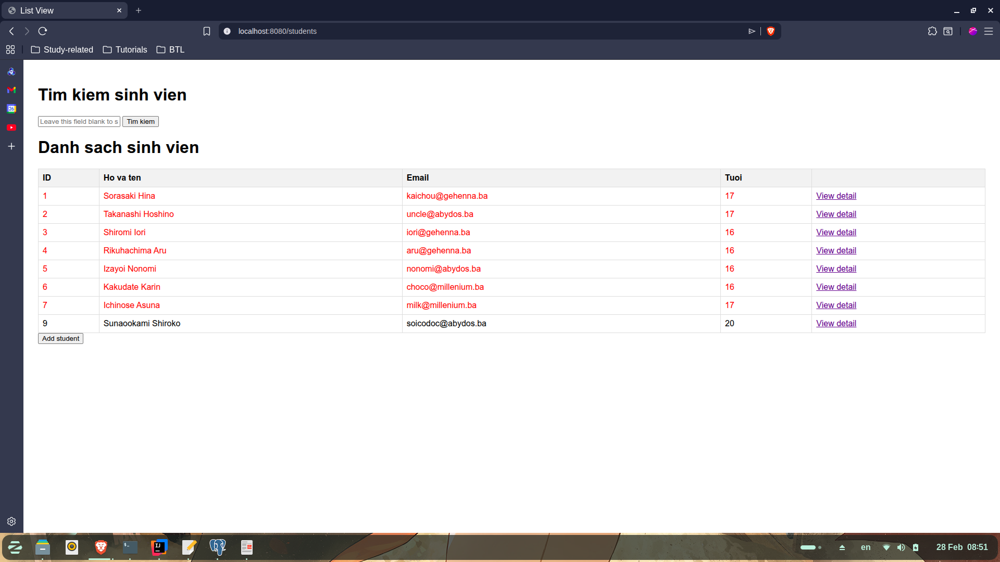
Tìm kiếm sinh viên:
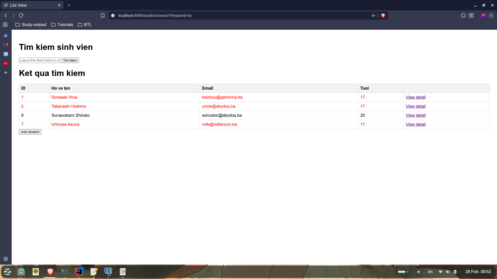
Chi tiết sinh viên:
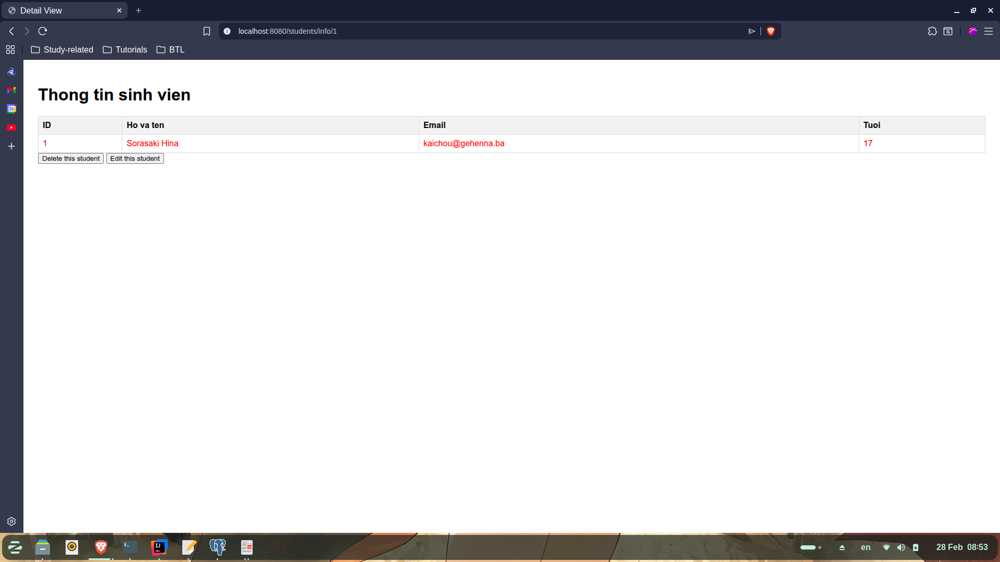
Xóa sinh viên:
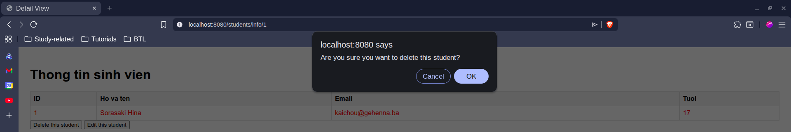
Thêm sinh viên:
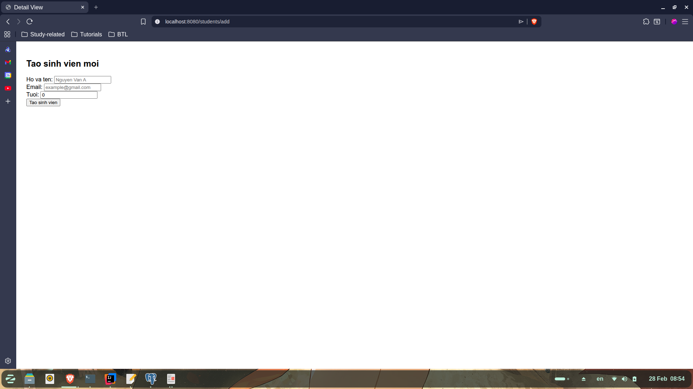


Danh sách sinh viên:
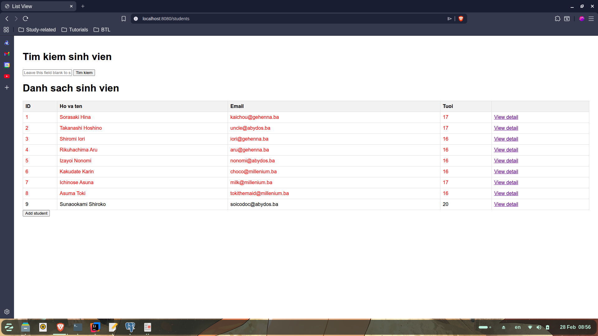
Chi tiết sinh viên:
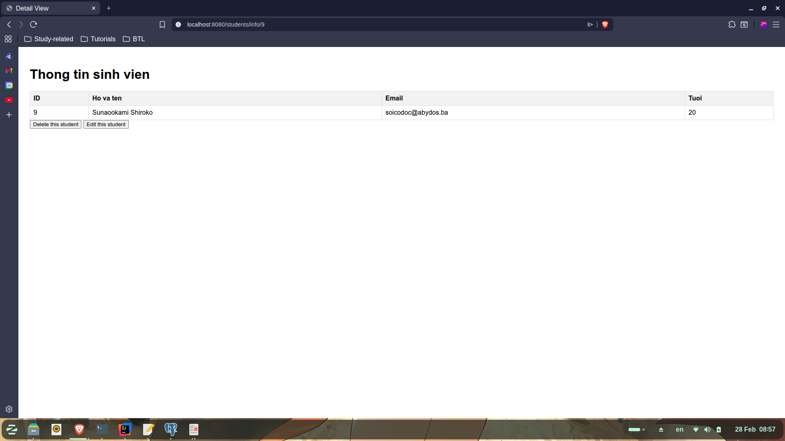
Chỉnh sửa sinh viên:


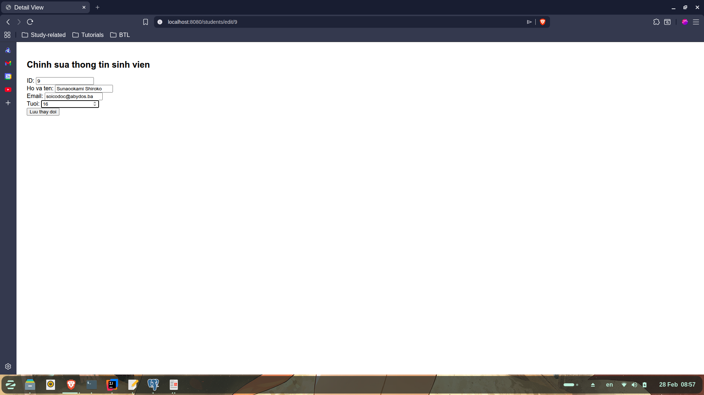
Danh sách sinh viên;
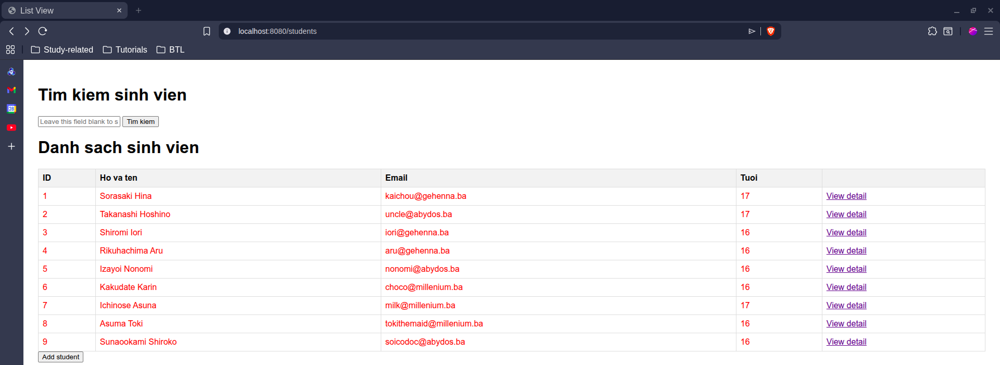
Chi tiết sinh viên:
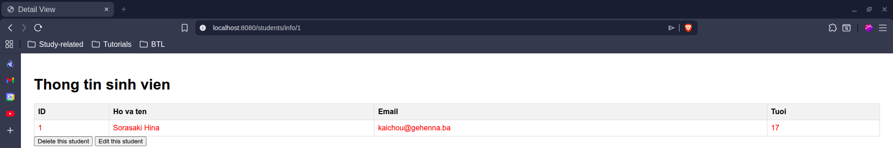
Xóa sinh viên:
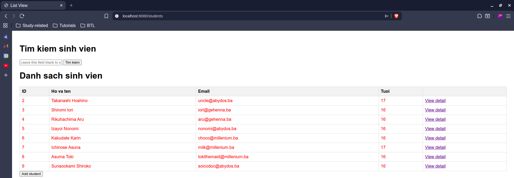
